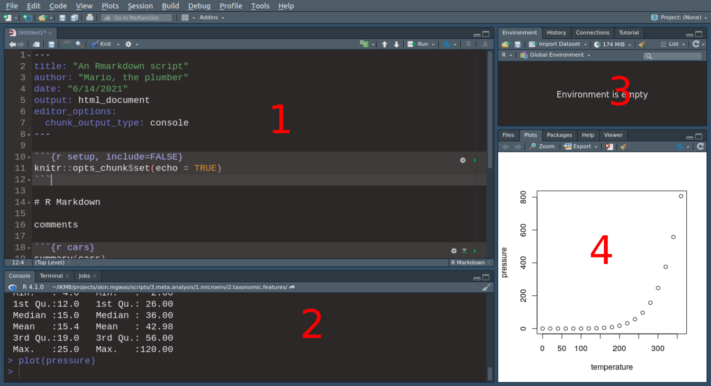

# Load tidyverse
This is how you load packages into R. Packages contain a series of functions and data developed by R community. We will be working with tidyverse. Normally, you load all the packages needed at the beginning of your code.

```{r}
library(tidyverse)
```

# Objective

Introduce you to R using [tidyverse](https://www.tidyverse.org/). This is not aimed to be an exhaustive tutorial. 

# R

R is a software language for statistical analyses. There is tons of excellent quality info out there. So, we will focus on the practical aspects of it.

## The Rstudio environment




**1.** Source. Here is where you write your scripts. You can run them using `Crtl + Enter`. 

**2.** Here is the console. Where R actually is. To run commands in R, can type them directly here or you can run from source. 

**3.** Panel showing environments, history etc. Every object that you create or import is accessible/viewed here.

**4.** Panel with Files, Plot, Help... Pretty useful to visualize your plots and access help of functions.

## Rmarkdown

There are two basic ways to write and store series of commands in R: R scripts (finishes with `.R`) and Rmarkdown (finishes in `.Rmd`). This is an Rmardown document. We prefer to use it because it allows for tracking results and codes together into a narrative-like writing style. The Rmarkdown has the following structure.
* 1. It has a **header** (see first lines), with instructions to R to know how to deal with the Rmarkdown file. 
* 2. It has a space for comments and everything that **R will not interpret as a code** (this session for instance). R uses [markdown syntax](https://www.markdownguide.org/basic-syntax/) to format the text.
* 3. And it has **code chunks** as seen below. Everything written there is interpreted by R as a code. If you want to write something in the code area but not want R to interpret as instructions you can use `#` to comment. 

```{r}
"R reads this because this is a string"
#R don't read this because this is a comment
```

## Getting help

* Just ask!
* `help.start()` and the HTML help button in the Windows GUI.
* `help` and `?`: `help("data.frame")` or `?help`.
* `help.search()`, `apropos()`. example, `apropos("sum")`
* `browseVignettes("package")`
* rseek.org
* There is always the internet :)


# Basic data types and functions

R is an object-oriented language, so every data item is an object in R. These are the following basic data types in R.

* numeric: real number
```{r}
1
```

* character: chain of characters, text
```{r}
"1"
```

* logical: TRUE, FALSE
```{r}
TRUE
FALSE
```

* special values:  NA (missing value), NULL ("empty object"),
Inf,  -Inf (infinity), NaN (not a number) 
```{r}
NA
```

## Assignments

It is practical to store objects and values into named objects. You assign names to values using `<-` as `name_of_object <- value`.
```{r}
x <- 6
x
y <- "object y is a text"
y
z <- FALSE
z
```

Now check that the *x*, *y* and *z* appeared on the environment. Use the function `ls()` to inspect the environment using the console.

## Functions

Functions contain operations that will be applied to objects. Functions have arguments which normally are of two kinds: 1. the **data** to which the operations will be applied on. 2. the **details** of the operations.


```{r}
x <- 1
y <- "text"

print(x)
print(y)
print(y, quote = FALSE)
```

* Remember that you can use `?` (e.g. `?print()`) or the panel **4** to get information about functions arguments.
* Use the `TAB` keyboard to get suggestion of function and object names with AUTOCOMPLETE. This is very useful!


__Exercise: Play with data types__

Assign different object types to letters (example, `a <- 1`) and inspect them using the check functions `is.*` (example, `is.character(a)`) and `str`. 


# Data types and arithmetic

```{r}
4 + 6
```


## Vectors

```{r}
z <- c(5, 9, 1, 0)
#this is a comment within the code.
z
```
__Exercise: Creating sequences__

- 1. Try out using the function `seq()` to create a vector from 1 to 9 skipping every second number. Store results in a object name "odds".
- 2. Use the function rep to create a vector with the number 1 repeated ten times. 
Hint: you can inspect what the function does by typing `?seq()`.

## Factor: categorical data that takes a fixed set of values
Similar to vectors, but are designed to represent categorical data that can take a fixed set of possible values. Factors are built on top of integers, and have a levels attribute:
```{r}
factor(1)
x <- factor(c("wt", "wt", "mut", "mut"), levels = c("wt", "mut"))
x
```

## Component-wise operations

```{r}
x <- c(6, 8 , 9 )
x + 2
```


Two useful functions to keep in mind:

* `length`, which returns the length of a vector (i.e. the number of elements it contains)
* `sum` which calculates the sum of the elements of a vector

other interesting ones

*  ` mean(a)`
*  ` summary(a)`
*  ` min(a,b)`, `max(a,b)`

# Summaries, subscripting and useful vector functions

Let's suppose we've collected some data from an experiment and stored them in an object `x`.
Some simple summary statistics of these data can be produced:

```{r summary_1,   echo = TRUE}
x <- c(7.5, 8.2, 3.1, 5.6, 8.2, 9.3, 6.5, 7.0, 9.3, 1.2, 14.5, 6.2)
mean(x)
var(x)
summary(x)
```


You can pick one or more elements of a vector by using the `[]` and the `index` of the element.

It is easy to get the first element by indicating its index (1).

```{r}
x[1]
```

You can substract one element of the vector as well using `-`. For instance, get all elements except the 3rd.

```{r}
x[-3]
```

And you can use a vector of indexes to select one of more elements.

```{r}
x[c(1,5,8)]
x[-(1:6)]
```

Subscripting is very useful. For instance, using the experimental data about, let's suppose that we subsequently learn that the first 6 data points correspond to measurements made in one experiment, and the second six on another experiment.
This might suggest summarizing the two sets of data separately, so we would need to extract from
`x` the two relevant subvectors. This is achieved by subscripting.

```{r subscr,   echo = TRUE}
x[1:6]
x[7:12]
summary(x[1:6])
summary(x[7:12])
```


The function `head` provides a preview of the vector. 
```{r}
head(x)
```

There are also useful functions to order and sort vectors:


*  `sort`:  sort in increasing order
*  `order`: orders the indexes is such a way that the elements of the vector are sorted, i.e `sort(v) =  v[order(v)]` 
*  `rank`: gives the ranks of the elements
of a vector, different options for handling *ties* are
available. 


```{r sort-rank,   echo = TRUE}
x <- c(1.3, 3.5, 2.7, 6.3, 6.3)
sort(x)
order(x)
x[order(x)]
rank(x)
```


__Exercise: Milk sales and summaries__

* Define
x <- c(5, 9, 2, 3, 4, 6, 7, 0, 8, 12, 2, 9) 


Decide what the result will be of the following:


*  x[2] 
*  x[2:4] 
*  x[c(2, 3, 6)] 
*  x[c(1:5, 10:12)] 
*  x[-(10:12)] 


Use R to check your answers.

*   The vector  y <- c(33, 44, 29, 16, 25, 45, 33, 19, 54, 22, 21, 49, 11, 24, 56) contains
sales of milk in liters for 5 days in three different shops (the first 3 values are for shops 1, 2 and 3 on
Monday, etc.). Produce a statistical summary of the sales a given day of the week and also for a given shop.


# Matrices, lists,  data frames and basic data handling

## Matrices

Matrices are two--dimensional vectors and 
can be created in R  in a variety of ways.

### Creating matrices
Create the columns and then glue them together with the command `cbind`. For example:


```{r cbind-ex,   echo = TRUE}
x <- c(5, 7 , 9)
y <- c(6, 3 , 4)
z <- cbind(x, y)
z
dim(z)
```

We can also use the function `matrix()` directly to create a matrix.
```{r matrix_direct,   echo = TRUE}
z <- matrix(c(5, 7, 9, 6, 3, 4), nrow = 3)
```

There is a similar command, `rbind`, for building matrices by gluing rows together.
The functions `cbind` and `rbind` can also be applied to matrices themselves  (provided the dimensions match) to form larger matrices.

### Matrices operations

R will try to interpret operations on matrices in a natural way. 
For example, with z as above, and y defined below we get:

```{r Matrix-op,   echo = TRUE}
y <- matrix(c(1, 3, 0, 9, 5, -1), nrow = 3, byrow = TRUE)
y
y + z
y * z
```

Notice that multiplication here is component--wise.
As with vectors it is useful to be able to extract sub-components of matrices. 

### Subsetting

As before, the `[ ]` notation is used to subscript. The following examples illustrate this:

```{r Matrix-op-4,   echo = TRUE}
z[1, 1]
z[, 2]
z[1:2, ]
z[-1, ]
z[-c(1, 2), ]
```

So, in particular, it is necessary to specify which rows and columns are required, whilst omitting the index for either dimension implies that every element in that dimension is selected.


## Data frames (tibbles) and lists


A data frame is  a matrix where the columns can have different data types.
As such, it is usually used to represent a whole data set, where the rows
represent the samples and columns the variables. Essentially, you can think
of a data frame as an excel table.

[Tidyverse](https://www.tidyverse.org/) is a collection of R packages for data science. In tidyverse, the package `r CRANpkg("tibble")` improves the conventional R `data.frame` class. A tibble is a `data.frame` which a lot of tweaks and more sensible defaults that make your life easier.


Let's illustrate this by the small data set saved in comma--separated-format (csv) ---
`patients`. We load it in from a website using the function
`read_csv`, which is used to import a data file in *comma separated format --- csv* into R. In a .csv--file the data  are stored row--wise, and the entries in each row are separated by commas. 

The function `read_csv` is from the `r CRANpkg("readr")` package and will
give us a tibble as the result. The function `glimpse()` gives a nice summary of a tibble.

```{r load-Patients,   echo = TRUE}
pat <- read_csv("http://www-huber.embl.de/users/klaus/BasicR/Patients.csv")
pat
glimpse(pat)
```

It has weight, height and gender of three people. 

## Accessing data in data frames

Now that we have imported the small data set, you might be wondering how to 
actually access the data. For this the functions `filter` and `select` from
the `r CRANpkg("dplyr")` package of the `r CRANpkg("tidyverse")` are useful.
`filter` will select  certain rows (observations),
while `select` will subset the columns (variables of the data). 

In the following command, we get all the patients that are less tall than 1.5 and select their Height and
Gender as well as their Id:

```{r subset_data}
pat_tiny <- filter(pat, Height < 1.7)
select(pat_tiny, PatientId,  Height, Gender)
```

There are a couple of operators useful for comparisons:

*  `Variable == value`: equal
*  `Variable != value`: un--equal
*  `Variable < value`: less
*  `Variable > value`: greater
*  `&: and`
*  `|` or
*  `!`: negation
*  `%in%`: is element?

The function `filter` allows us to combine multiple conditions easily, 
if you specify multiple of them, they will automatically concatenated via a `&`.
For example, we can easily get light and female patients via:


```{r light_and_small_patients,   echo = TRUE}
filter(pat, Height < 1.5, Gender == "f")
```
We can also retrieve small OR female patients via

```{r light_or_small_patients,   echo = TRUE}
filter(pat, (Height < 1.5) | (Gender == "f"))
```

## Vectors with arbitrary contents: Lists

Lists can be viewed as vectors that contain not only elementary objects such 
as number or strings but can potentially arbitrary objects. The following example will make this clear. The list that we create contains a number, two vectors
and a string that is itself part of a list.


```{r list_example,   echo = TRUE}
L <- list(one = 1, two = c(1, 2), five = seq(1, 4, length = 5), 
          list(string = "Hello World"))
L
```

Lists are the most general data type in R. In fact, data frames (tibbles) are
lists with elements of equal lengths. List elements can either be accessed by 
their name using the dollar sign `$` or via their position via a double 
bracket operator `[[]]`.

```{r list_access,   echo = TRUE}
names(L)
L$five + 10
L[[3]] + 10
```

Using only a single bracket (`[]`) will extract a sublist, so the result will
always be a list, while the dollar sign `$` or the double bracket operator
`[[]]` removes a level of the list hierarchy. Thus, in order to access the 
string, we would first have to extract the sublist containing the string from `L`
and then get the actual string from the sublist, `[[` drills down into the list while `[` returns a new, smaller list. 

```{r}
L[[4]]$string
L[2]
```

Since data frames are just a special kind of lists, 
they can actually be accessed in the same way.

```{r list-example_df,   echo = TRUE}
pat$Height
pat[[2]]
pat[["Gender"]]
```

More on lists can be found in the respective chapter of "R for data science"
[here](http://r4ds.had.co.nz/vectors.html#lists).

## Summary: data access in R

We prepare a simple vector to illustrate the access options again:

```{r acces_recap}
sample_vector <- c("Alice" = 5.4, "Bob" = 3.7, "Claire" = 8.8)
sample_vector
```

### Access by index

The simplest way to access the elements in a vector is via their indices.
Specifically, you provide a vector of indices to say which
elements from the vector you want to retrieve. A minus sign excludes the respective
positions

```{r  access_index, dependson="accesRecap"}
sample_vector[1:2]
sample_vector[-(1:2)]
```


### Access by boolean

If you generate a boolean vector the same size as your actual vector you can use the positions of the true values to pull out certain positions from the full set. You can also use smaller boolean vectors and they will be concatenated to match all of the positions in the vector, but this is less common.


```{r  access_boolean, dependson="acces_recap"}
sample_vector[c(TRUE, FALSE, TRUE)]
```

This can also be used in conjunction with logical tests
which generate a boolean result. Boolean vectors can be combined with logical operators
to create more complex filters.

```{r  access_boolean2, dependson="acces_recap"}
sample_vector[sample_vector < 6]
```

### Access by name

if there are names such as
column names present (note that rowname are not preserved in the tidyverse), 
you can access by name as well:

```{r access_name}
sample_vector[c("Alice", "Claire")]
```


## Computing variables from existing ones and predicate functions

First, let's load example data from the internet
```{r}
load(url("http://www-huber.embl.de/users/klaus/BasicR/bodyfat.rda"))
bodyfat <- as_tibble(bodyfat)
bodyfat
```

Hint: You can explore the dataset using the previously learned functions (for instance, from section *Summaries, subscripting and useful vector functions* and `glimpse`) or the environment panel. 


Use mutate to compute make a new column or compute derived quantities. For example, we might be interested in the weight in kilograms instead of pounds and the height in meters instead of inches. The function `mutate` allows us to do this.

```{r transform_example}
pb_to_kg <- 1/2.2046
inch_to_m <- 0.0254

bodyfat <- mutate(bodyfat, height_m = height * inch_to_m,  
                  weight_kg = weight * pb_to_kg)

select(bodyfat, height,  height_m, weight, weight_kg)

bodyfat <- mutate(bodyfat, weight_binned = cut(weight_kg, 5))
```

# Combine sequences of actions with pipes

Use `%>%` (pipe) to emphasize a sequence of actions, rather than the object that the actions are being performed on. Pipe is a function from `r CRANpkg("magrittr")`. New versions of R (> 4.1) have a native pipe: `|>`. Pipes are useful to skip the need of naming intermediate files.

Pipes redirects the object placed before the pipe to the function placed after the pipe.
```{r}
bodyfat_selected <- bodyfat %>% #object here is a data.frame
  mutate(., height_m = height * inch_to_m) %>% # The object data frame is placed where you indicate it with an ".".
  mutate(weight_kg = weight * pb_to_kg) %>% # Also, pipe places automatically in the first position of the function
  select(height, height_m, weight, weight_kg)

glimpse(bodyfat_selected)
```


__Exercise: Handling a small data set__

* Import the data set `Patients.csv` from the website

[http://www-huber.embl.de/users/klaus/BasicR/Patients.csv](http://www-huber.embl.de/users/klaus/BasicR/Patients.csv)

* Which variables are stored in the data frame and what are their values?
* Is there a missing weight value?  If yes, replace it by the mean of the other weight values.
* Calculate the  __BMI = Weight / Height^2__  of all the patients.


# Programming statements

R offers the typical options for flow--control known from many other languages. 

The most important one, the **if--statement** is used when certain computations should only be performed if a certain condition is met (and maybe something else should be performed when the condition is not met):


```{r if_example,   echo = TRUE, eval = TRUE}
w <- 3
if (w < 5) {
  d <- 2
} else {
  d <- 10
}
d
```


If you want perform a computation for every entry of a list,
you usually do  the computations for one time step and then for
the next and the next, etc. Because nobody wants 
to type the same commands over and over again,
these computations are automated in  __for--loops__.

```{r for_example,   echo = TRUE, eval = TRUE}
h <- seq(from = 1, to = 8)
s <- numeric() # create empty  vector
for (i in 1:8)
{
  s[i] <- h[i] * 10
}
s
```

There is a function in tidyverse called `map` that can be used for this purpose, but we will skip it for sake of simplicity. For it, see sources below.


Another useful command is the __ifelse__--command, it replaces 
elements of a vector based on the evaluation of another logical vector of the same size. This is useful to replace missing
values, or to binarize a vector.

```{r ifelse-example,   echo = TRUE, eval = TRUE}
s <- seq(from = 1, to = 10)
binary_s <- ifelse(s > 5, "high", "low")
binary_s
```


# Plots with ggplot2

The package `r CRANpkg("ggplot2")` allows very flexible plotting in R. It is very power but it has its own grammar, which is not very intuitive at first.

There are 3 basic components of ggplot2 grammar:

*  **Data.** The dataframe to be plotted
* **Geometrics.** The geommetric shape to represent the data (e.g., point, boxplot)
* **Aesthetics.** The aesthetics of the geometric object (e.g., color, size, shape)


Ggplots are build up by combining the plot elements. For instance, first you build the plot are, then you select the geometrics and their aesthetics. See example below.


Build plot frames.
```{r}
ggplot(data = bodyfat, aes(x = abdomen.circum, y = percent.fat))
```

Add plot geometrics. In this case we are plotting a scatter plot, which is a done by plotting points (geometric `geom_point`). Note that we are using an `+` to add the geometrics to the plot area.

```{r}
ggplot(data = bodyfat, aes(x = abdomen.circum, y = percent.fat)) +
  geom_point()
```

Now that we have a basic plot to outlined, we can work on geometric aesthetics.
```{r}
# make the size proportional to the age
ggplot(data = bodyfat, aes(x = abdomen.circum, y = percent.fat)) +
  geom_point(aes(size = age)) 
#colour by binned weight
ggplot(data = bodyfat, aes(x = abdomen.circum, y = percent.fat)) +
  geom_point(aes(color = weight_binned))
```

Another kind of plot: histogram. Similarly, first the plot frame is build, followed by the geometric.
```{r}
bodyfat %>% # note that we are using pipe to redirect the data frame to the function ggplot
  ggplot(aes(x = percent.fat)) +
  geom_histogram()
```

Another kind of plot: Box plots.

```{r}
bodyfat %>% 
  ggplot(aes(x = weight_binned, y = percent.fat)) +
  geom_boxplot()
```

Different geometric can be combined, for instance boxplot and points.

```{r}
bodyfat %>% 
  ggplot(aes(x = weight_binned, y = percent.fat)) +
  geom_boxplot(outlier.color = NA) +
  geom_point()
```
Different geometrics offer different visualization of the same data.

```{r}
bodyfat %>% 
  ggplot(aes(x = weight_binned, y = percent.fat)) +
  geom_boxplot(outlier.color = NA) +
  geom_jitter()
```

Plot appearance can also be done without being dependent on a specific variable. For instance, color all points blue or add transparancy to all of points. These modifications are done out of the `aes()` functions, but withing the geometric functions (`geom_*`)
```{r}
bodyfat %>% 
  ggplot(aes(x = weight_binned, y = percent.fat)) +
  geom_boxplot(outlier.color = NA) +
  geom_jitter(alpha = 0.5, # alpha is transparency
              color = "blue") 

```

Any aspects of the plot can be modified. For instance, we are making the plot more informative by adding labels to the axes.

```{r}
bodyfat %>% 
  ggplot(aes(x = weight_binned, y = percent.fat)) +
  geom_boxplot(outlier.color = NA) +
  geom_jitter(alpha = 0.5, # alpha is transparency
              color = "blue") +
  labs(x = "Weight bins", y = "Fat (%)") +
  theme_classic()
```

You can do much much more with ggplot2. Some good ideas ideas are found on the tutorial by [Zev Ross and Cédric Scherer](https://www.cedricscherer.com/2019/08/05/a-ggplot2-tutorial-for-beautiful-plotting-in-r/).


# Sources

* Most of this tutorial is an *ipsis litteris* copy of the tutorial given by [Bernd Klaus at the EMBL in 2017](https://www.huber.embl.de/users/klaus/tidyverse_R_intro/R-lab.html).


* We also got inspired and got some ideas from the slides from [Olivier Gimenez workshop on reproducible science](https://oliviergimenez.github.io/reproducible-science-workshop/).

* For more extensive and view of R coding with Tidyverse see their [style guide](https://style.tidyverse.org/).


# Answers to exercises

__Exercise: Creating sequences__

- 1. Try out using the function `seq()` to create a vector from 1 to 9 skipping every second number. Store results in a object name "odds".
- 2. Use the function rep to create a vector with the number 1 repeated ten times. 
Hint: you can inspect what the function does by typing `?seq()`.


__Solution: Creating sequences__

```{r,   echo = TRUE, results='hide'}
odds <- seq(1,10, by = 2)
rep(1,10)
```


__Exercise: Milk sales and summaries__

The vector  y<-c(33, 44, 29, 16, 25, 45, 33, 19, 54, 22, 21, 49, 11, 24, 56) contains sales of milk in liters for 5 days in three different shops (the first 3 values are for shops 1, 2 and 3 on
Monday, etc.). Produce a statistical summary of the sales a given day of the week and also for a given shop.


__Solution: Milk sales and summaries__

```{r,   echo = TRUE, results = 'hide'}
y <- c(33, 44, 29, 16, 25, 45, 33, 19, 54, 22, 21, 49, 11, 24, 56)
# day of the week summary, example: Tuesday
Tuesday <- y[ (1:3) + 3 ]
summary(Tuesday)
## Shop 2 summary
Shop2 <- y[ seq(2, length(y), by = 3 )  ]
summary(Shop2)


## alternative: turn into a tibble and use map functions

y_mat <- t(matrix(y, nrow = 3, ncol = 5, byrow = FALSE))
y_tibble <- as_tibble(y_mat)
names(y_tibble) <- c("Shop_1", "Shop_2", "Shop_3")
map(y_tibble, summary)

# summary by days

days <- matrix(y, nrow = 3, ncol = 5, byrow = FALSE)
days <- as_tibble(days)
names(days) <- c("Monday", "Tuesday", "Wednesday", "Thursday", "Friday")
map(days, summary)
```


__Exercise: Play with data types__


Assign different object types to letters (example, a <- 1) and inspect them using the check functions is.* (example, is.character(a)) and str.


__Solution: Play with data types__

```{r,   echo = TRUE, results='hide'}
a <- 1
b <- "1"
c <- TRUE

is.numeric(a)
is.numeric(b)
is.factor(b)
#etc..
```

__Exercise: Handling a small data set__

* Import the data set `Patients.csv` from the website

[http://www-huber.embl.de/users/klaus/BasicR/Patients.csv](http://www-huber.embl.de/users/klaus/BasicR/Patients.csv)

* Which variables are stored in the data frame and what are their values?
* Is there a missing weight value?  If yes, replace it by the mean of the other weight values.
* Calculate the  __BMI = Weight / Height^2__  of all the patients.


__Solution: Handling a small data set__

```{r,   echo = TRUE, results = 'hide', message=FALSE}
pat <- read_csv("http://www-huber.embl.de/users/klaus/BasicR/Patients.csv")
pat

pat$Weight[is.na(pat$Weight)] <- mean(pat$Weight, na.rm = TRUE)
pat


pat <- mutate(pat, BMI = Weight / Height^2)
```

# Session information

```{r}
sessionInfo()
```


